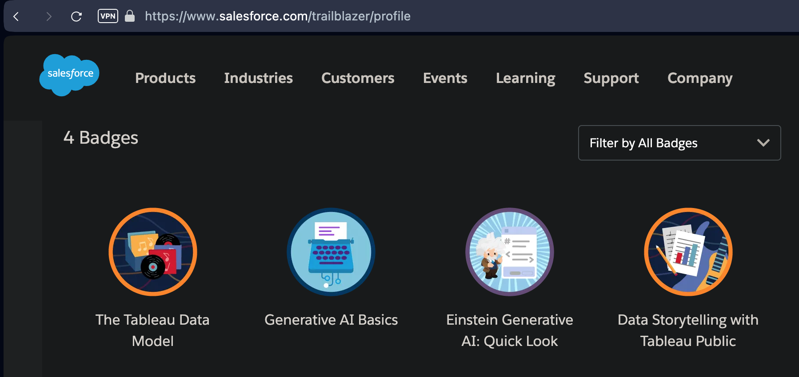
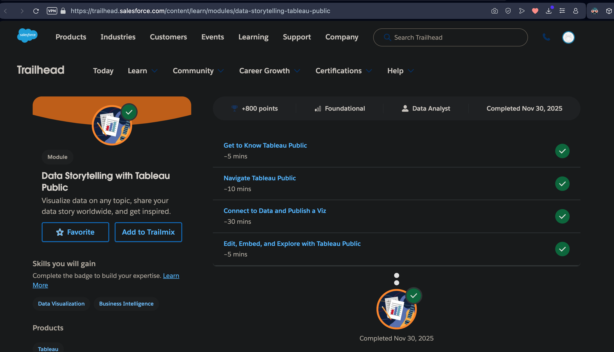
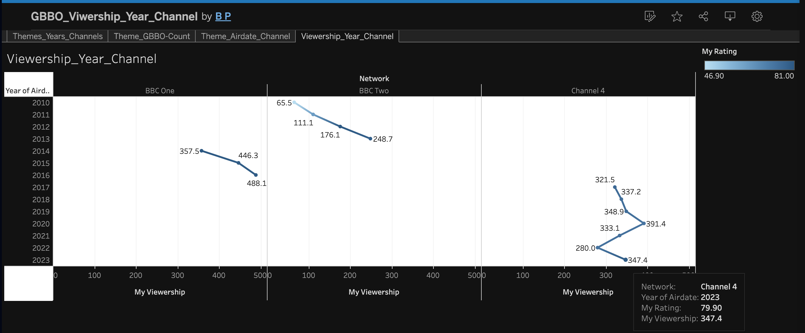
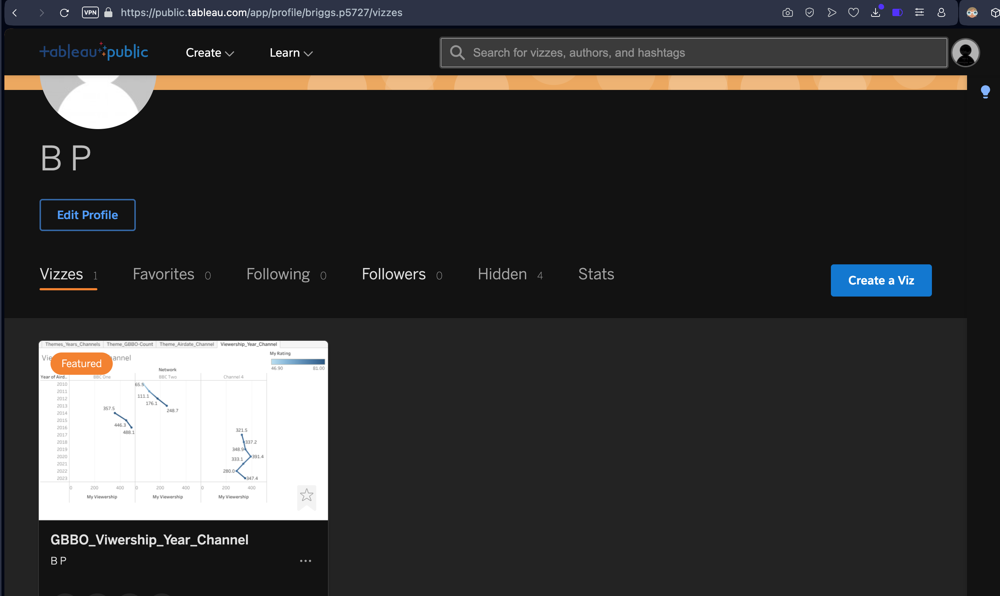
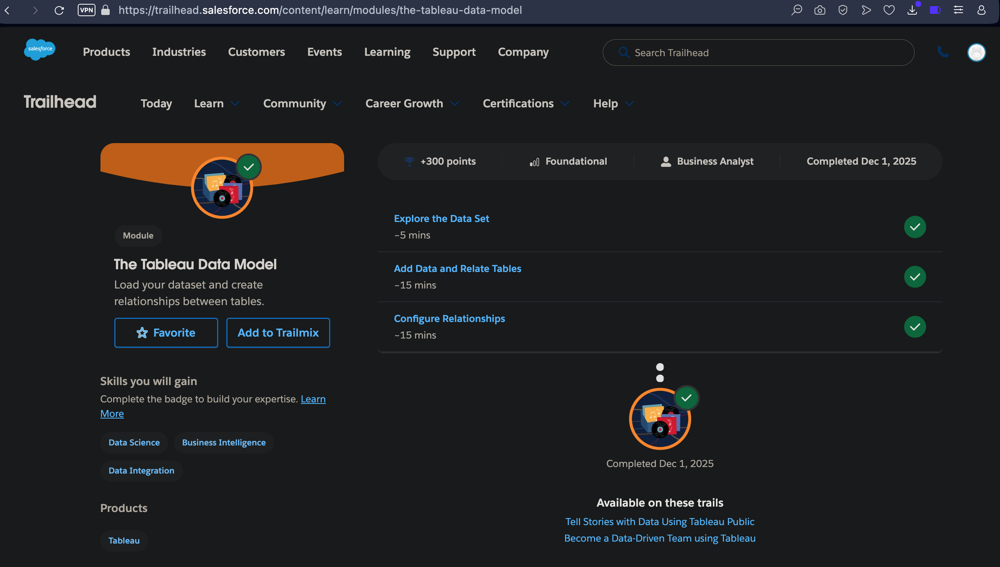
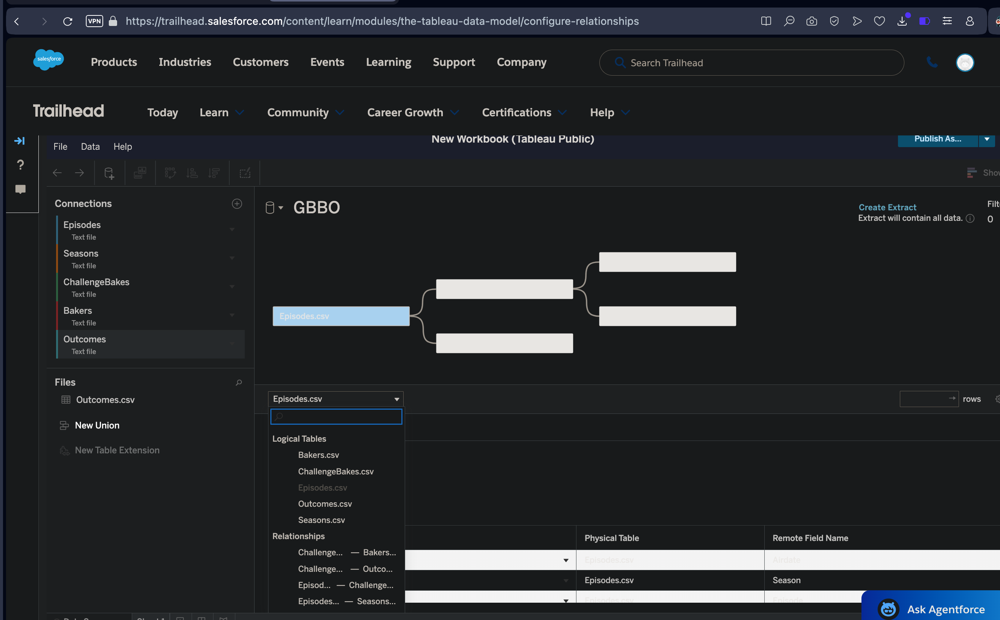

# Tableau Trailhead

### Links

<a href="https://public.tableau.com/app/profile/briggs.p5727/viz/GreatBritishBakingShow_17645475261900/">Tableau Public Profile</a> 

<a href="https://public.tableau.com/app/profile/briggs.p5727/viz/GBBO_Viwership_Year_Channel_17645518609160/Viewership_Year_Channel">Link to Tableau Visualizations on Public Profile</a> 

### All badges

 

DataStory with Tableau

### Badge

### Visualization

 

 

 

Tableau Data Model

### Badge

### Visualization

 

 

Reflections

 

### Data Storytelling:
Combining different aspects of the dataset, and arranging them in different configurations in Tableau was fun and showed the complexities involved and possibilities in playing arund with data visualization.

### Data Model:
For databases with multiple tables and complex data models, creating relationships (auto or manual) helps better analyze the data for insights, visibility, etc. 

### Healthcare Scenario:
Various aspects of patient care on patient portals can be improved with better visualizations. The Tableau's toggling features and customizability can be a great asset for patients (complexity of Tableau features visualizations can easily be reduced). There are multiple other healthcare use cases.

